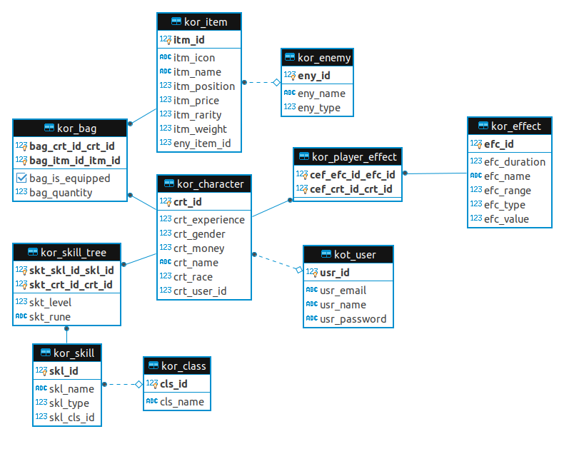

# kot-rpg

[comment]: <> ([![Build Status]&#40;https://travis-ci.org/yanBrandao/kot-rpg.svg?branch=master&#41;]&#40;https://travis-ci.org/yanBrandao/kot-rpg&#41;)
[comment]: <> ([![Coverage Status]&#40;https://coveralls.io/repos/github/yanBrandao/kot-rpg/badge.svg?branch=master&#41;]&#40;https://coveralls.io/github/yanBrandao/kot-rpg?branch=master&#41;)

KOT-RPG is a REST API developed in Spring-boot using **Kotlin** and Hexagonal architecture based in **D**omain **D**riven **D**evelopment. The main goal of this API is to store a player information based in a **r**ole-**p**lay **g**ame. 
This is a living project, so if you want to use or change something, just email me.

## ER

## Under construction :construction:

After some big changes, this project documentation is under construction. :D
Sorry for inconvenient.