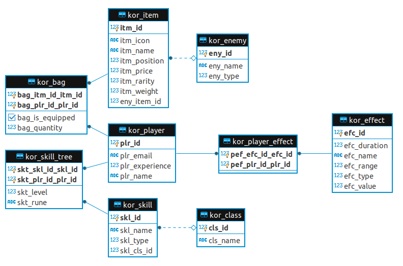

# kot-rpg

[](https://coveralls.io/github/yanBrandao/kot-rpg?branch=develop)
[](https://hitsofcode.com/view/github/yanBrandao/kot-rpg)

KOT-RPG is a REST API developed in Spring-boot Java using Clean Architecture as code style. The main goal of this API is to store a player information based in a RPG game. 
This is a living project, so if you want to use or change something, just send me an email.


## UML

Actually there's only three main classes, that represent player equipments, and players status afflicted by game effects, it can be a positive effect like a `BUFF`, or negative effect `DEBUFF`, but there's another type of effect called `AURA` that have specified range, all others effects has 0 of range.
Another important thing is that item cannot be placed in a different position in player, so for this when player have an equipment, the item position need to be the same as equipped. 




## Running the project

To run KOT-RPG project, I recommend to follow the steps below:

 - Make an account in Blizzard API: https://develop.battle.net
 - After that, create a new client for your application in: https://develop.battle.net/access/clients
 - It will generate a ClientID and ClientSecret, now you need to setup some environments variables to run the application.
 - KOT-RPG use `PostgresSQL` to persiste game information.
 - I recommend use docker version with this command: `docker run --name kot_database -p your_port:5432 -e POSTGRES_PASSWORD=your_password -d postgres`
 - With all setup you can set the environments variables below:
```ruby
 DB_HOST=localhost
 DB_USER=postgres;
 DB_PASS=your_password
 DB_PORT=your_port;
 
 BLIZZ_USER=your_blizzard_ClientID;
 BLIZZ_PASS=your_blizzard_ClientSecret;
```

 - Now you can run application with ./gradlew clean bootRun